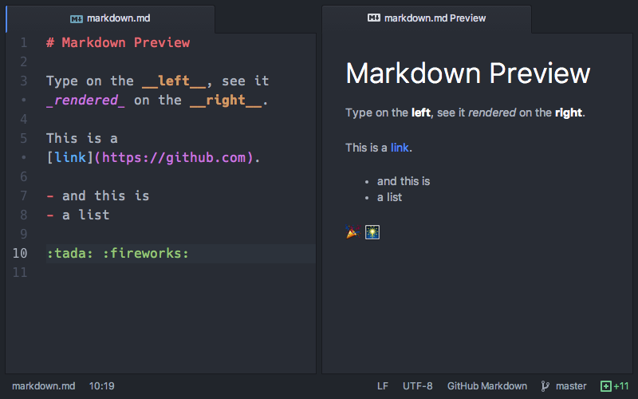

```{r setup, include=FALSE}
knitr::opts_chunk$set(echo = TRUE)
```

# **1. Páginas con recursos sobre Expresiones Regulares**


### 1.1 Página Web 1

Wikipedia es una página web conocida mundialmente por facilitarnos la búsqueda de absolutamente cualquier tema. En este caso no fue la excepción, [Wikipedia - Expresiones Regulares](https://es.wikipedia.org/wiki/Expresi%C3%B3n_regular) explica detalladamente lo que es una expresión regular, la construcción de la misma y sus aplicaciones. En mi opinión esta página es peor ya que sirve únicamente para definir lo que es cada una de las expresiones regulares y la función de cada una. 

### 1.2 Página Web 2
[Adictos al Trabajo](https://www.adictosaltrabajo.com/2015/01/29/regexsam/) es una portal de tutoriales acerca de la tecnología y programación donde escriben profesionales en activo. Pienso que esta página es mejor ya que no solamente define lo que es una expresión regular, sino que también muestra ejemplos de como usarlas e ilustra el resultado de las expresiones una vez puestas en código.

# **2. Páginas con recursos sobre Markdown**



### 2.1 Página Web 1
[Recursos Markdown](https://docs.microsoft.com/en-us/contribute/how-to-write-use-markdown) en Microsoft es funcional pero se queda corta en contenido. En mi opinión esta página es peor ya que no es completa, únicamente explica sin ilustración lo más basico como son los titulos, listas y tablas.

### 2.2 Página Web 2
[Recursos Markdown](https://swcarpentry.github.io/r-novice-gapminder-es/15-knitr-markdown/) en Software Carpentry Foundation muestra como crear informes en Markdown mostrando conceptos básicos y fragmentos de código en R. Por estas dos razones pienso que esta página es mejor ya que explica e ilustra cada uno de los conceptos de una manera en que cualquier persona pueda entender para que funciona cada línea que se escribe en el Markdown.

# **3. Analisis de Datos**
El dataset utilizado es el Crecimiento de Árboles de Naranja (Orange). El dataframe consiste de 35 filas y 3 columnas que contienen datos de crecimiento de los arboles. Las columnas son:

1. Tree = un factor ordenado que indica el árbol en el que se realiza la medición. El orden es de acuerdo con el aumento del diámetro máximo.

2. Age = Un vector numérico que indica la edad del árbol (días desde 1968/12/31).

3. Circumference = Un vector numérico de circunferencias del tronco (mm). Probablemente sea "circunferencia a la altura del pecho", una medida estándar en la silvicultura.


### 3.1 Representación Gráfica
El siguiente gráfico muestra el tamaño de circunferencia de los cinco árboles en orden de menor a mayor. Se puede visualizar que el árbol No. 4 alcanzó la mayor circunferencia, siendo esta de 214 mm. 
```{r pressure, echo=FALSE, message=FALSE}
library(ggplot2)
orange_2 <- Orange

ggplot(orange_2, aes(x = Tree, y = circumference, color = 'red')) + 
  geom_point() + geom_smooth() +
  theme(legend.position = 'bottom')
```

### 3.2 GGPLOT con Facetas
Se puede visualizar que los árboles 2 y 4 son los que a lo largo de los años obtuvieron un mayor crecimiento en circunferencia.

```{r, echo=FALSE, message=FALSE}
library(ggplot2)
orange_2 <- Orange

ggplot(orange_2, aes(x = age, y = circumference, color=Tree)) + 
  geom_point() + facet_wrap(~Tree)+ geom_smooth() +
  theme(legend.position = 'bottom')
```

### 3.3 Tabla
```{r results = "oasis", echo=FALSE, message=FALSE}
library(DT)
datatable(Orange)
```


